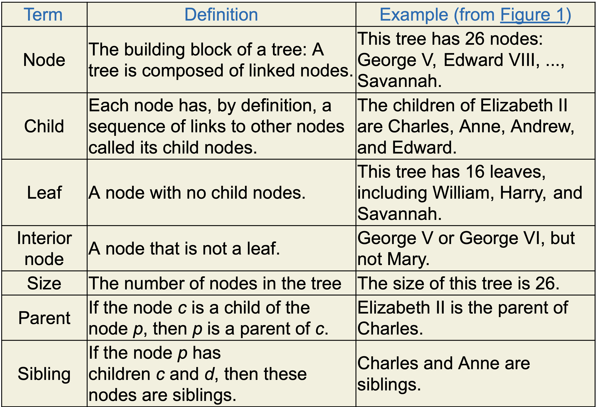

# Trees

## Shortcuts
---
### VSC Shortcuts
- ctrl + B -> opens side bar
- ctrl + J -> opens terminal window

### Terminal Shortcuts
- cd 'name' -> change directory
- ls -> list all folders and files within the directory
- pwd -> full path to current directory

### Git commands
- git clone 'address'
- git clone 'address'
- git pull -> pulls any changes

---
## Extentions
- C/C++ -> Microsoft
- C/C++ Extention Pack -> Microsoft
- Code Runner -> Jun Han
- Better C++ Syntax -> [Jeff Hykin](https://marketplace.visualstudio.com/items?itemName=jeff-hykin.better-cpp-syntax)
- CMake (disable in workspace) -> twxs
- CMake Tools -> Microsoft

---
## Notes
### Trees
 Tree data structures
- root at the top
- trees are like classes
### Terms

### additional notes
friend class Tree;
- friend keyword -> allows a class to use private members/functions.

#ifndef TREE_H
- preproccessor 

### multi-file compileing